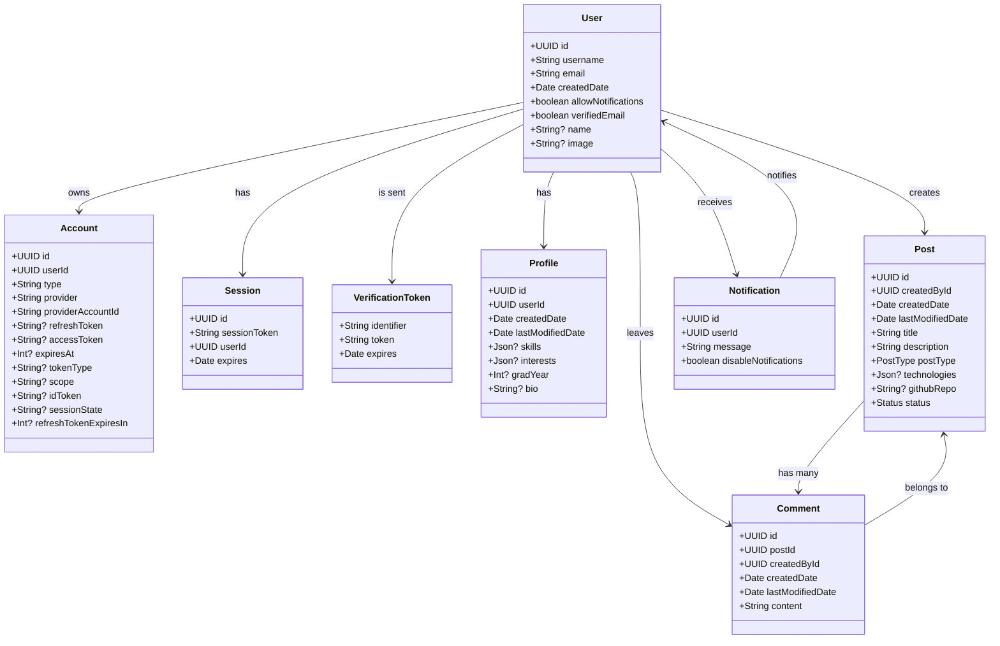

# UCollab

UCollab is a web platform created for University of Cincinnati students pursuing degrees in Information Technology (IT), Computer Science (CS), Information Systems (IS), and related fields. This platform facilitates project discovery, contributions, and peer feedback, enabling students to collaborate and share knowledge with others across various majors.

## Class Diagram



## Build Instructions

> [!Important]
> Building this project from source requires installing [Git](https://git-scm.com/), [NodeJS](https://nodejs.org/en), and [Docker](https://www.docker.com/products/docker-desktop/).

1. Clone the repository and change into the directory
   ```
   git clone https://github.com/steelesh/UCollab.git && cd UCollab
   ```
2. Create your .env file
   ```
   Copy .env.example and rename it to .env
   ```
3. Install the dependencies
   ```
    npm install
   ```
4. Start Docker Desktop
   ```
   docker desktop start
   ```
5. Run the development build
   ```
   npm run dev
   ```

### Created by

_Luke Halverson, Nawrs Alfardous, Paige Weitz, Steele Shreve & Zachary Thomas_
