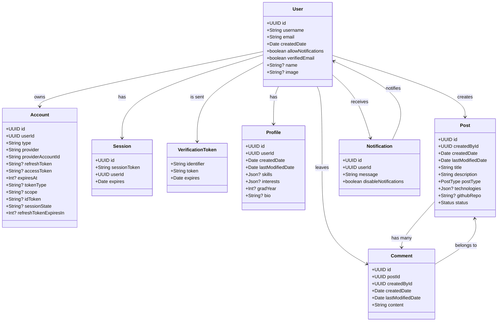

# 🗃️ UCollab Class Diagram

##  Overview
This class diagram describes our current database structure.

---

```mermaid
classDiagram
    class Account {
        +UUID id
        +UUID userId
        +String type
        +String provider
        +String providerAccountId
        +String? refreshToken
        +String? accessToken
        +Int? expiresAt
        +String? tokenType
        +String? scope
        +String? idToken
        +String? sessionState
        +Int? refreshTokenExpiresIn
    }
 
    class Session {
        +UUID id
        +String sessionToken
        +UUID userId
        +Date expires
    }
 
    class User {
        +UUID id
        +String username
        +String email
        +Date createdDate
        +boolean allowNotifications
        +boolean verifiedEmail
        +String? name
        +String? image
    }
 
    class VerificationToken {
        +String identifier
        +String token
        +Date expires
    }
 
    class Profile {
        +UUID id
        +UUID userId
        +Date createdDate
        +Date lastModifiedDate
        +Json? skills
        +Json? interests
        +Int? gradYear
        +String? bio
    }
 
    class Post {
        +UUID id
        +UUID createdById
        +Date createdDate
        +Date lastModifiedDate
        +String title
        +String description
        +PostType postType
        +Json? technologies
        +String? githubRepo
        +Status status
    }
 
    class Comment {
        +UUID id
        +UUID postId
        +UUID createdById
        +Date createdDate
        +Date lastModifiedDate
        +String content
    }
 
    class Notification {
        +UUID id
        +UUID userId
        +String message
        +boolean disableNotifications
    }
 
    User --> Post : creates
    User --> Comment : leaves
    User --> Profile : has
    User --> Notification : receives
    User --> Account : owns
    User --> Session : has
    User --> VerificationToken : is sent
    Post --> Comment : has many
    Comment --> Post : belongs to
    Notification --> User : notifies
```
